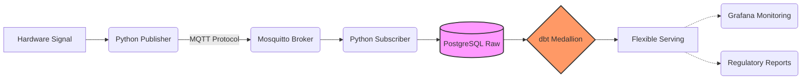

# Laboratory Telemetry: Event-Driven ELT Pipeline

### Project Overview
This project implements a resilient telemetry pipeline designed to standardize data ingestion from high-precision instruments. By replacing manual logging with an **Event-Driven ELT pattern**, the system transforms raw sensor signals into traceable, audit-ready analytical assets. This framework serves as an internal operational standard, ensuring that every measurement follows a transparent and documented path from the hardware to the final report.

---

### 1. Context and Metrological Rigor (ISO/IEC 17025)
In a regulated laboratory, maintaining the technical validity of results is a requirement. Manual data recording introduces risks of information loss and low-resolution records, which can lead to non-conformities during audits.

This pipeline was built under the concept of **"measurement rigor"**: treating data with the same care as a physical record. The architecture ensures that measurements are persisted in real-time, satisfying the traceability requirements of the **ISO/IEC 17025** standard.

---

### 2. Architectural Layers: ELT Pattern
The system is structured into four clear layers to decouple hardware communication from analytical consumption:

*   **Ingestion Layer (Pub/Sub):** Instrument-specific Python scripts act as publishers, broadcasting readings via **MQTT**.
*   **Storage Layer (Landing Zone):** A centralized subscriber captures the stream and performs an immediate load into **PostgreSQL**, preserving the **raw state exactly as received** to ensure a permanent audit trail.
*   **Modeling Layer (dbt):** Follows a **Medallion Architecture** to refine data incrementally through Bronze, Silver, and Gold stages.
*   **Serving Layer (Agnostic):** Provides a standardized SQL interface for various consumption tools, such as Grafana or custom LIMS reports.

---

### 3. Technical Decisions
Each component of the stack was chosen to solve specific operational challenges:

*   **Why MQTT?:** This lightweight protocol was selected for its resilience. It handles network micro-cuts gracefully, ensuring data integrity is maintained even in unstable internal network environments.
*   **Why dbt?:** Centralizing transformation logic in code prevents "hidden logic" within dashboard formulas or spreadsheets. This approach ensures that data cleaning and validation rules are versioned, documented, and auditable.

---

### 4. Data Quality Gates & Automated Validation
To ensure only valid measurements reach the decision layer, the modeling stage implements automated **Data Quality Gates** via dbt tests:

*   **Freshness Control:** Monitoring latency to detect sensor timeouts or network failures.
*   **Physical Boundary Tests:** Automated rules to detect missing readings or values that fall outside the physical limits of the laboratory environment.
*   **Artifact Filtering:** In the Silver layer, the system automatically removes initialization artifacts, such as the zero-readings produced when a serial port is opened.

---

### 5. Operational Complexity and Industrial Context
This system was designed under real-world constraints:

*   **Scalability & Maintainability:** The design favors a straightforward, containerized setup (Docker Compose) over complex distributed systems like Kafka. This keeps maintenance low while meeting the lab's actual operational scale.
*   **Network Environment:** The architecture is optimized for a stable, internal laboratory network, prioritizing the security and consistency of sensitive metrological telemetry.

---

### 6. Flexible Consumption & Observability
While the system is agnostic, a specific implementation using **Grafana** demonstrates the power of this architecture:

*   **Real-time Stability:** For temperature sensors, the system calculates Mean and Standard Deviation ($s$) over dynamic time windows, allowing technicians to visually confirm instrument stability before starting a calibration.

---

### Technical Stack
*   **Languages:** Python, SQL.
*   **Data Modeling & Quality:** dbt (PostgreSQL).
*   **Messaging & IoT Infrastructure:** MQTT (Mosquitto), Docker Compose.
*   **Observability:** Grafana (Example implementation).

*Real-time Grafana dashboard visualizing temperature telemetry stored in PostgreSQL, showing a highly stable 0 °C signal at the water triple point (ice bath) with time window, sample count, mean, standard deviation, minimum, and maximum values*
