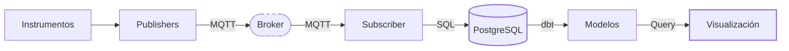
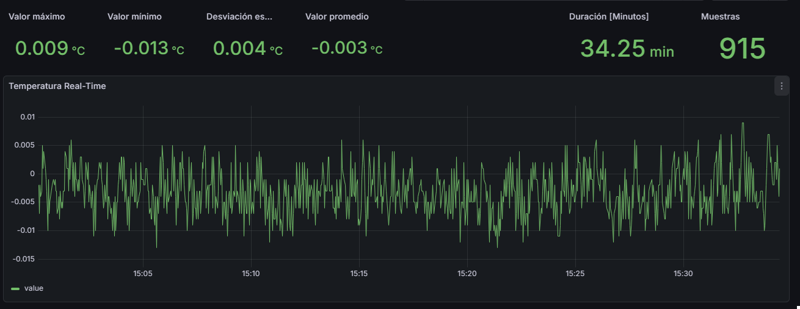
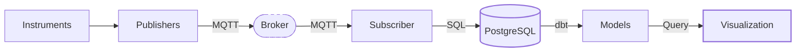

  
<strong>Versión en español:</strong>
  

# Pipeline de Telemetría: Estandarización de Datos de Instrumentos

Este repositorio contiene la implementación de un pipeline de telemetría de punta a punta diseñado para estandarizar la entrada de datos en un laboratorio de calibración. El objetivo principal fue reemplazar el registro manual por un patrón ELT resiliente, capturando lecturas crudas de instrumentos y transformándolas en datasets listos para el análisis.

---

### 1. Enfoque Arquitectónico

El foco de esta arquitectura es proporcionar una interfaz unificada para cualquier equipo, sin importar su protocolo de comunicación (Serial o Red). Al desacoplar la ingesta, el almacenamiento y la visualización, el sistema no depende de un software específico para cada sensor, logrando un pipeline modular y mucho más robusto.

Este diseño asegura:

* **Persistencia de Datos:** Las lecturas se capturan y guardan independientemente de la capa de visualización. No hay pérdida de datos si las herramientas de monitoreo están caídas.
* **Integridad:** Los modelos de transformación permiten filtrar ruido y errores de comunicación antes de que los datos lleguen a la etapa de análisis.
* **Escalabilidad:** Sumar equipos nuevos es sencillo; solo se requiere un publisher dedicado apuntando al mismo broker compartido.

---

### 2. Arquitectura y Flujo de Trabajo

El pipeline está diseñado bajo un enfoque **Event-Driven**, utilizando un patrón **ELT (Extract, Load, Transform)** para mover la telemetría desde el hardware hacia la capa analítica.

#### Ingesta de Datos (Pub/Sub)

La capa de ingesta se apoya en un broker **Mosquitto (MQTT)**. Scripts en Python actúan como **Publishers**, enviando la telemetría al broker, mientras que un servicio **Subscriber** centralizado captura los mensajes y los carga directamente en una base de datos **PostgreSQL**.

Este setup permite que la base de datos funcione como un "landing zone", preservando el estado crudo de la telemetría y manteniendo el sistema en pie aunque fallen las capas de visualización o procesamiento.

#### Transformación (dbt)

Toda la lógica de transformación está centralizada en **dbt**. Usé la **Arquitectura Medallion** (Bronze, Silver, Gold) como referencia funcional:

* **Bronze (Crudo):** Persistencia de la telemetría en Postgres tal cual se recibe del sensor.
* **Silver (Staging):** Limpieza esencial, tipado de datos y remoción de valores de inicialización (como los ceros al abrir un puerto).
* **Gold (Marts):** Datasets listos para analizar, incluyendo cálculos de estabilidad en ventanas de tiempo definidas.

#### Validación Automatizada

El modelado en dbt permite dejar lista la estructura para implementar **tests de calidad de datos**. Esto facilita la creación de reglas para detectar lecturas faltantes o valores fuera de los límites físicos del laboratorio antes de que se tomen decisiones basadas en esos datos.

---

### 3. Consumo y Visualización

La arquitectura es agnóstica respecto a la capa de consumo. Como los datos están modelados en **PostgreSQL**, pueden conectarse a distintas herramientas según la necesidad técnica del instrumento.

#### Ejemplo de Implementación: **Grafana**

Para este proyecto, usamos **Grafana** para monitorear un sensor de temperatura de alta precisión. En tareas de calibración, ver la curva de estabilidad en tiempo real es una necesidad crítica.

* **Lógica Específica:** El dashboard calcula el promedio, la desviación estándar ($s$), cantidad de muestras, máximos y mínimos de forma dinámica sobre el tiempo seleccionado.
* **Flexibilidad:** El pipeline está preparado para soportar otras plataformas o requerimientos analíticos a medida que se integren nuevos equipos al laboratorio.

*Panel de Grafana en tiempo real que visualiza la temperatura medida y almacenada en PostgreSQL, mostrando una señal de 0 °C altamente estable en el punto triple del agua (baño de hielo) con ventana de tiempo, recuento de muestras, media, desviación estándar y valores mínimo y máximo*

---

### 4. Decisiones Técnicas y Balance de Diseño

* **Centralización con dbt:** Elegí dbt para que las reglas de limpieza y validación vivan en el código. Esto evita que la lógica crítica quede fragmentada en fórmulas de Excel o queries sueltas en un dashboard.
* **Resiliencia con MQTT:** Es un protocolo liviano y robusto. En un laboratorio bajo normas **ISO**, la rigurosidad es fundamental. MQTT maneja bien los micro-cortes de red, asegurando la integridad del dato desde que sale del sensor hasta que se guarda.
* **Contexto Industrial:** A medida que los procesos adoptan marcos de IoT, la gestión de datos estructurada se vuelve vital. Esta arquitectura es una respuesta pragmática a los requerimientos de telemetría de un laboratorio moderno.

---

### 5. Compromisos de Diseño y Futuras Mejoras

El sistema fue diseñado pensando en la realidad de un laboratorio, priorizando la claridad y la mantenibilidad:

* **Escala de Laboratorio:** El sistema está ajustado para la precisión necesaria en metrología, manteniendo la infraestructura alineada con el volumen real de datos del laboratorio.
* **Simplicidad Operativa:** Se priorizó una configuración directa y fácil de auditar, evitando la complejidad de sistemas distribuidos (como Kafka) que no son requeridos para este flujo de trabajo.
* **Entorno de Red:** El diseño está optimizado para una red interna estable, priorizando la consistencia y seguridad de la telemetría dentro de un entorno controlado.

---

### 6. Estructura del Repositorio

* `/publishers`: Scripts de comunicación con hardware (ej. Fluke 1524).
* `/subscriber`: Servicio puente entre el broker MQTT y PostgreSQL.
* `/dbt_models`: Modelos SQL para limpieza, transformación y tests de calidad.

*(Este proyecto sirve como un estándar operativo de datos dentro del laboratorio, asegurando que cada medición tenga un camino transparente y trazable).*

  
  

 

  
<strong>English version:</strong>
  

  # Laboratory Telemetry Pipeline: A Standard for Instrument Data

This repository contains an end-to-end telemetry pipeline designed to standardize data ingestion in a calibration laboratory. The goal was to replace manual logging with a resilient ELT pattern, capturing raw readings from instruments and transforming them into analytical-ready datasets.

---

### 1. The Big Picture

The focus of this architecture is to provide a unified interface for any instrument, regardless of its communication protocol (Serial or Network). By decoupling the ingestion, storage, and visualization layers, the system avoids the need for hardware-specific software, creating a more modular and resilient pipeline.

This design ensures:

* **Data Persistence:** Readings are captured and stored independently of the visualization layer, ensuring no data loss if the monitoring tools are offline.
* **Data Integrity:** Transformation models allow for filtering noise and communication artifacts before the data reaches the analysis stage.
* **Scalability:** The architecture simplifies the integration of new equipment; adding an instrument only requires a dedicated publisher pointing to the shared broker.

---

### 2. Architecture and Data Workflow

The pipeline is designed around an **Event-Driven** approach, utilizing an **ELT (Extract, Load, Transform)** pattern to move telemetry from the physical hardware to the analytical layer.

#### Data Ingestion (Pub/Sub)

The ingestion layer relies on a **Mosquitto (MQTT)** broker. Hardware-specific scripts act as **Publishers**, sending telemetry to the broker. A centralized **Subscriber** service then captures these messages and loads them directly into a **PostgreSQL** database.

This setup treats the database as a landing zone, preserving the raw state of the telemetry. By decoupling the hardware from the storage, the system remains resilient to interruptions in the visualization or processing layers.

#### Data Transformation (dbt)

All transformation logic is centralized in **dbt**. The **Medallion Architecture** (Bronze, Silver, Gold) serves as a structural reference for organizing the data lifecycle:
* **Raw (Bronze):** Telemetry is first persisted in PostgreSQL exactly as received from the MQTT subscriber, preserving the original measurement payload without transformation.
* **Staging (Silver):** This layer applies essential cleaning logic, including type casting and removal of initialization artifacts such as zero readings.
* **Marts (Gold):** These views provide analysis-ready datasets, including stability calculations over defined time windows.

#### Automated Validation

The modeling layer in dbt provides a structured foundation for implementing automated **data quality tests**. This enables the definition of rules to detect missing readings or values outside physical laboratory limits before data is used for analysis or decision-making.

---

### 3. Data Serving and Visualization

The architecture is agnostic regarding the consumption layer. Because the data is modeled and stored in **PostgreSQL**, it can be plugged into different tools based on the technical requirements of each instrument.

#### Implementation Example: **Grafana**

In this specific project, **Grafana** was used to monitor a high-precision temperature sensor. For calibration tasks, the ability to visualize the stabilization process in real-time is a core requirement.

* **Instrument-Specific Logic:** For this case, the dashboard was configured to calculate the mean, standard deviation ($s$), and min/max values dynamically. This allows for the analysis of the sensor's behavior over any selected time window.
* **System Flexibility:** While these specific metrics were developed for the temperature sensor, the pipeline is ready to support other visualization platforms or different analytical requirements as new equipment is integrated into the laboratory.

*Real-time Grafana dashboard visualizing temperature telemetry stored in PostgreSQL, showing a highly stable 0 °C signal at the water triple point (ice bath) with time window, sample count, mean, standard deviation, minimum, and maximum values*

---

### 4. Technical Considerations and Decisions

* **Why dbt?:** The choice of dbt ensures that all data cleaning rules and validation logic are managed within the codebase. This approach avoids having critical transformations fragmented across different dashboard queries or hidden within spreadsheets.
* **Why MQTT?:** It provides a lightweight and robust communication layer. In a laboratory environment operating under ISO/IEC 17025 requirements, maintaining measurement rigor is essential. This protocol handles network interruptions gracefully, ensuring that data integrity is preserved from the moment a reading is generated until it is securely stored in the database.
* **Industry Context:** As industrial processes increasingly adopt IoT frameworks, the demand for structured and reliable data management grows. This architecture provides a pragmatic way to handle the telemetry requirements of modern calibration and monitoring workflows.

---
### 5. Design Trade-offs and Operational Context

The architecture was built to address the specific requirements of a calibration laboratory, focusing on clarity and reliability.

* **Laboratory Scale:** The system is tuned for the precision and data integrity required in metrology, keeping the infrastructure aligned with the actual number of instruments in the lab.
* **Maintainability:** The design favors a straightforward setup that is easy to manage and audit, avoiding unnecessary distributed complexity for this workflow.
* **Extensible Data Validation:** dbt models provide a structured foundation for implementing automated data quality tests as additional instruments are integrated.
* **Network Environment:** The design is optimized for a stable, internal laboratory network, prioritizing the consistency and security of the telemetry within a controlled environment.

---

### 6. Repository Structure

* `/publishers`: Scripts for hardware communication and data publishing (e.g., Fluke 1524).
* `/subscriber`: The service that bridges the MQTT broker and the PostgreSQL database.
* `/dbt_models`: SQL models for the staging and mart layers, including transformation logic and quality tests.

*(This project serves as an operational data standard within the laboratory, ensuring that every measurement is supported by a transparent and traceable data pipeline.)*